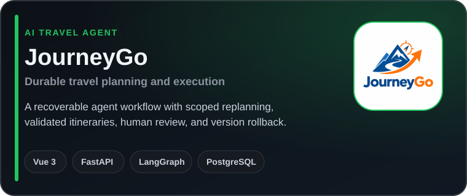
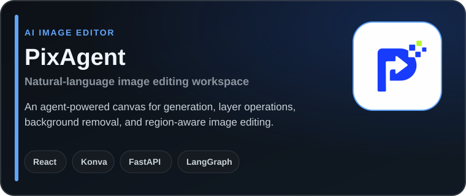

  

  
  
  
  
  

# 👋Hi there, I'm Caesar

[god3kill@163.com](mailto:god3kill@163.com) | AI Application Developer | Full-Stack Engineer

I build practical AI products that connect language models with real workflows. My work spans LLM agents, document intelligence, knowledge-base systems, AI image editing, full-stack applications, and automation. I am currently open to opportunities in AI application and full-stack engineering.

---

##  What I Build

- Reliable LLM agents with typed workflows, validation, and human review.
- Document intelligence and RAG systems for practical knowledge workflows.
- Full-stack AI products built with TypeScript, React or Vue, and Python.
- Image editing, digital human, and automation tools for real user needs.

---

##  Tech Stack

  
  
  
  
  
  
  
  
  
  
  
  
  
  

---

##  Featured Projects

  
  

---

##  GitHub Stats

  

  
  

  

---

<h2 align="center">
  
  How to reach me
</h2>

  &bull; Email: <a href="mailto:god3kill@163.com"><code>god3kill@163.com</code></a>
   
  &bull; GitHub: <a href="https://github.com/Xcaesar1">@Xcaesar1</a>
   
  &bull; Bilibili: <a href="https://space.bilibili.com/107019506">Caesar</a>

---

  Thanks for visiting.

  

